# Covid 19 Beds and ventillators information Application
Android Application using Java and firebase

# Download the apk
https://drive.google.com/file/d/1Em9Dmd2orNMoxeGm8BMA5zXpP5DwL1AW/view

# Project Title
include various features like Firebase authentication , features like reset password , various animations like splash animation , various android widgets like menu bar etc , 
Reverse Geocoding to find the current city and get Covid 19 active cases in that city from https://data.covid19india.org/v4/min/data.min.json  endpoint , & various CRUD operations and
error handling for data integrity.

# future work to do
Make app better in terns of UI and realworld use

# splash animation 
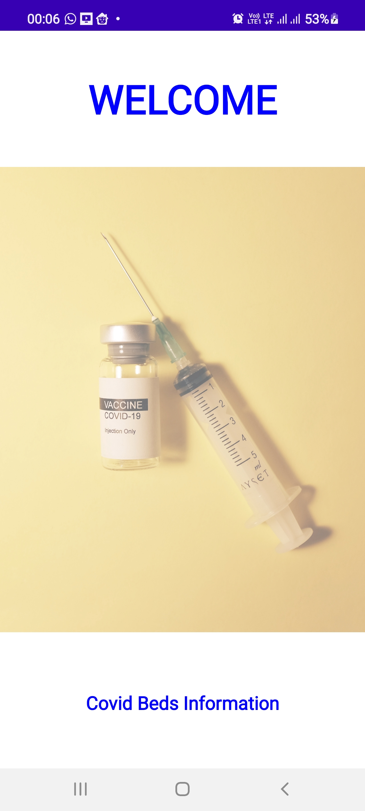</img>
# Login Window 
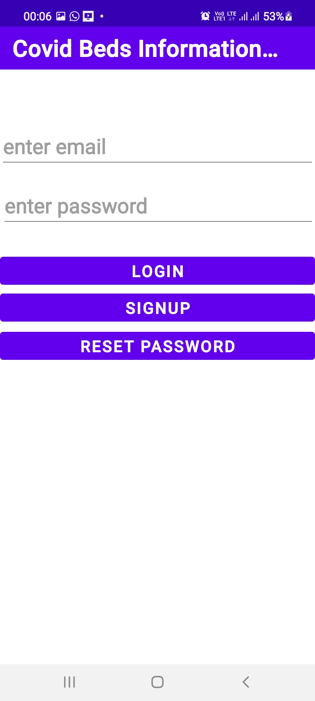</img>
# Signup Page
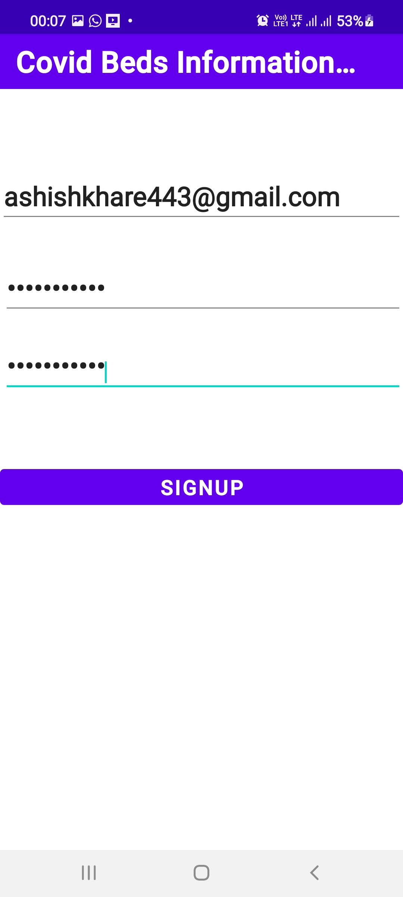</img>
# Reset Password
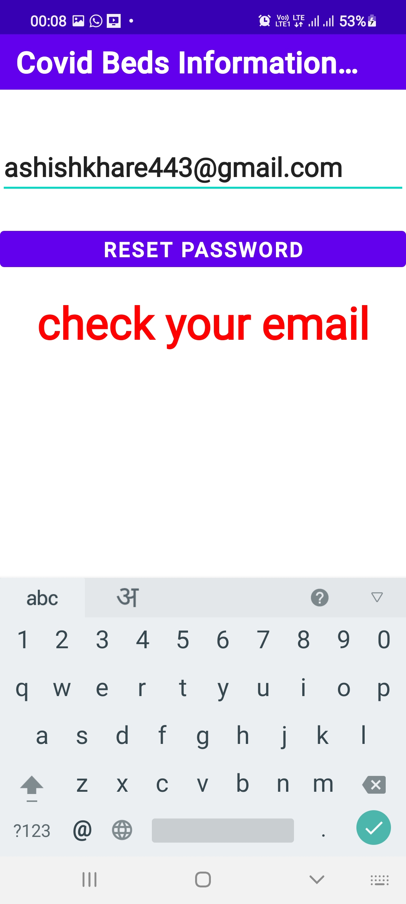</img>
# Reset Password mail received
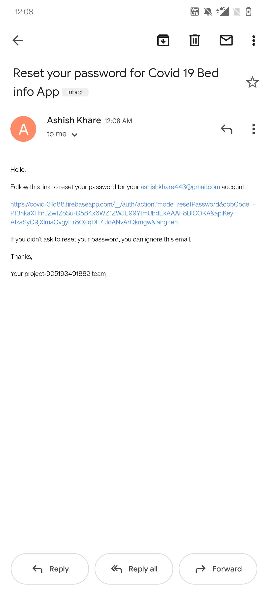</img>
# Location Permission allowed
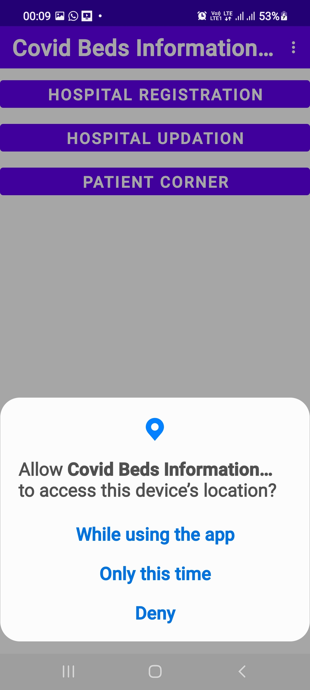</img>
# Active Covid 19 cases in his city
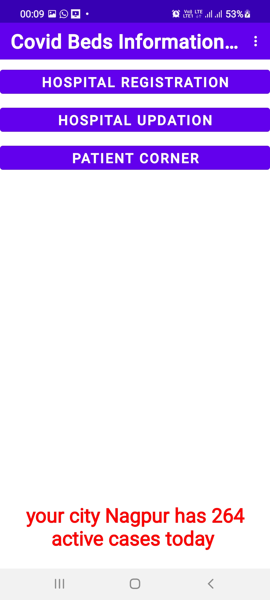</img>
# register window
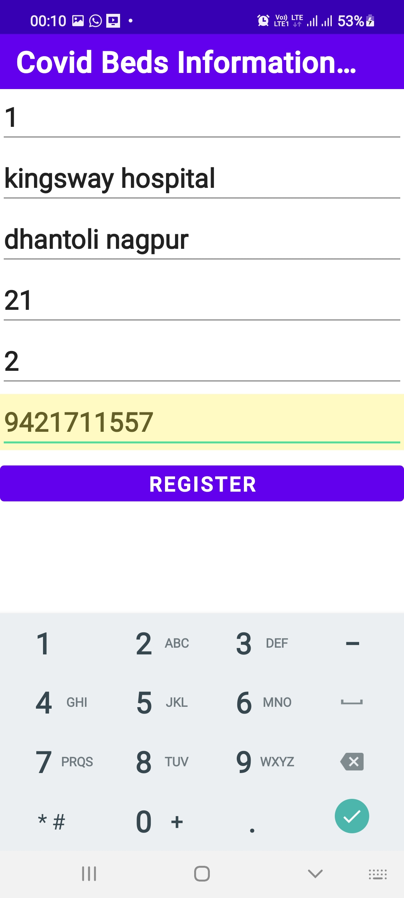</img>
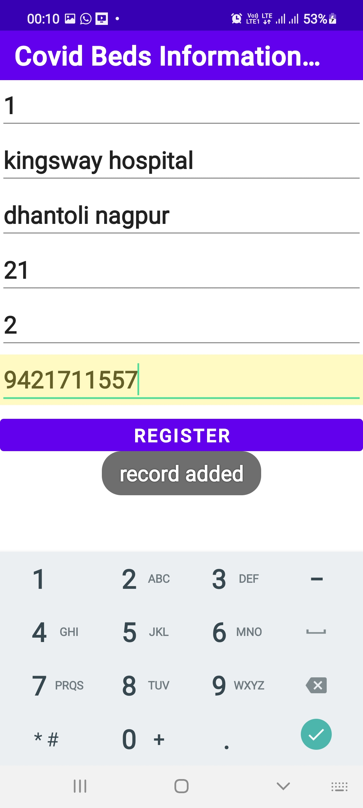</img>
# beds and ventilator information
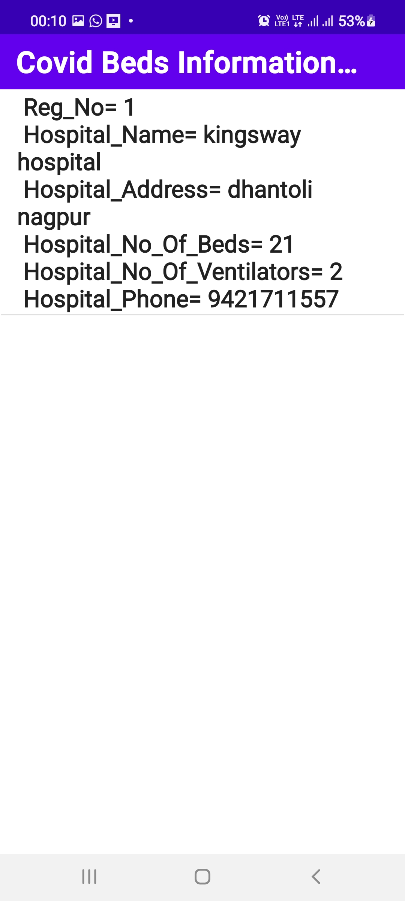</img>
# update information
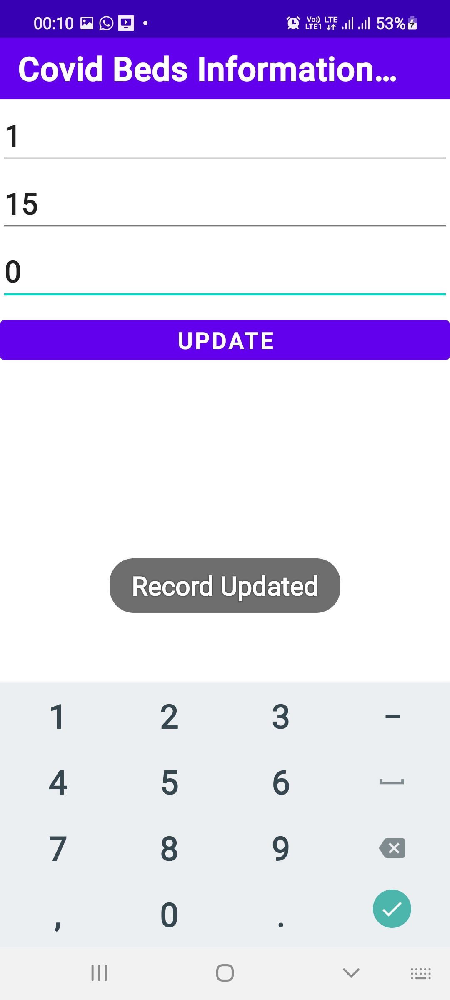</img>
# updated information
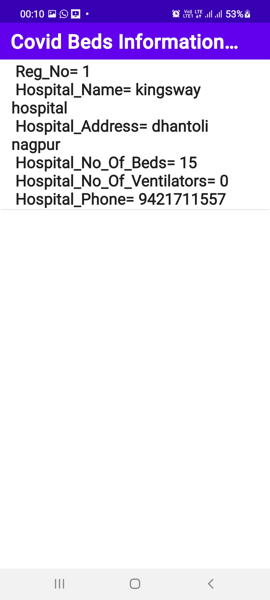</img>
# delete information
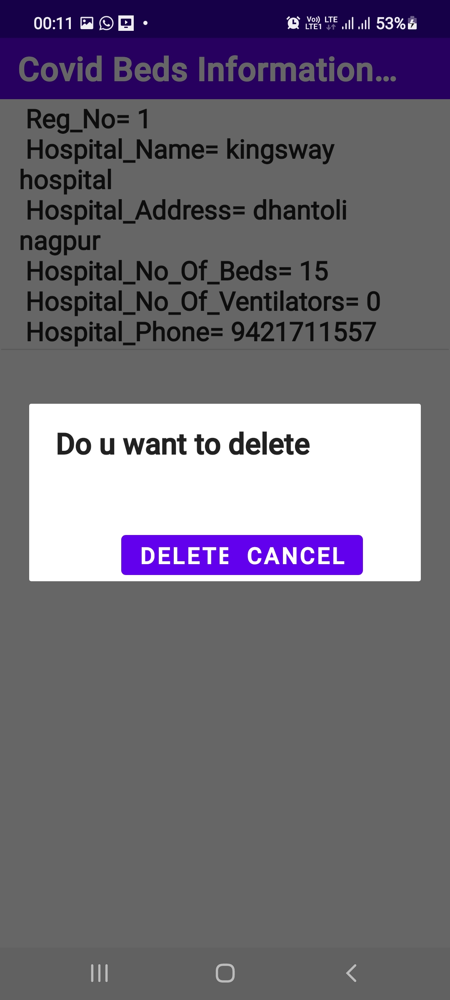</img>
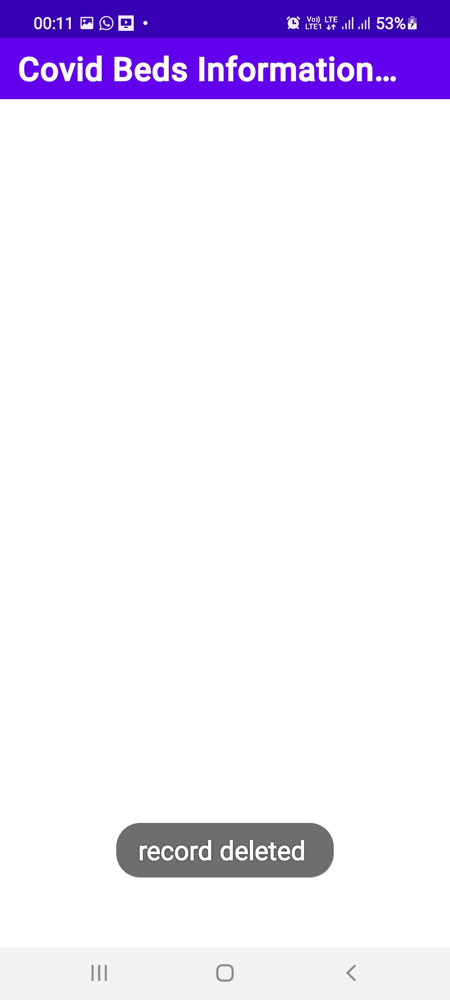</img>
# logout menu
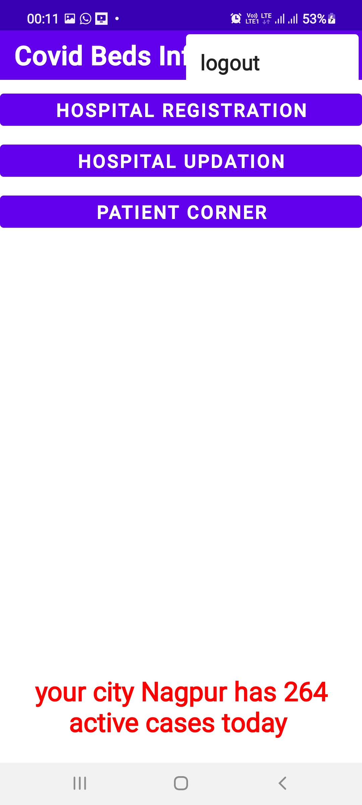</img>

